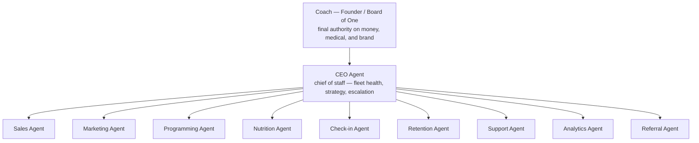

# Kynovant Autonomous Workforce — Technical Architecture

**Status:** Design only. Nothing in this document is implemented. No code, schema, or migration exists yet for anything described here.
**Thesis:** Kynovant is not "coaching software with some AI features bolted on." It is an AI-operated coaching company where one human — the coach — sits at the top as founder/final authority, and a fleet of specialized agents runs sales, marketing, programming, nutrition, retention, support, analytics, and referrals underneath them. The product surfaces already shipped (HQ, portal, Stripe, DocuSign, check-ins, Program Intelligence) are the agents' hands and eyes, not a separate thing the agents "integrate with."

---

## 0. How to read this document

1. §0.1 — a status legend, plus a scannable list of what already exists in the codebase versus what is conceptual only. Read this first; it's the fastest way to tell "reuse this" from "design this."
2. §1 — the org-chart framing and the **locked principles** this whole document is held to.
3. §2 — the orchestration layer: the infrastructure every agent plugs into. Read this before the agent roster; the agents are meaningless without it.
4. §3 — the permission-tier model referenced by every agent below.
5. §4 — the ten agents, each specified against the same seven dimensions plus cross-agent interactions.
6. §5 — the data model the orchestration layer needs (conceptual, not DDL).
7. §6 — rollout sequencing (crawl/walk/run) and the prerequisites that block autonomy tiers above "propose."
8. §7 — prohibited actions, mandatory human approval, destructive actions, and high-risk customer commitments.
9. §8 — recommended implementation order.

### 0.1 Status legend

Every capability, tool, and integration referenced below is tagged so implementation planning doesn't require re-deriving what's real:

- **[EXISTS]** — already shipped in the current codebase; this document reuses it, it does not reinvent it.
- **[CONCEPTUAL]** — new infrastructure or agent behavior with no code yet. Everything in this document is conceptual unless tagged [EXISTS]; the lists below call out the specific building blocks worth double-checking before anyone assumes they need to be built from scratch versus wired up.
- **[PREREQUISITE]** — must be true before the tagged capability may ship, regardless of how ready the capability itself is.
- **[HUMAN APPROVAL REQUIRED]** — the action never executes without a human — the coach, or in narrow fleet-ops cases CEO Agent acting inside a coach-approved envelope — approving it first.
- **[PROHIBITED]** — out of scope for any agent, at any tier, permanently, absent a separate explicit decision to amend this document.

#### What already exists in the codebase [EXISTS]

- Data model: `users`, `coachingEnrollments`, `clientPrograms`, `workoutSessions`, `weeklyCheckIns` (draft → submitted → in_review → reviewed), `clientNutritionTargets`, `documents`, `clientNotifications` (ADR-011).
- Program Intelligence Layer (PIL): `lib/pil/modules/*` — frequency, volume, joint-stress, and program-audit reasoning.
- Program APIs: template clone (`POST /api/internal/programs/[id]/clone`) and publish (`PUT /api/internal/programs/[id]` with `{ publish: true }`).
- Compliance/risk signal: `AttentionLevel` (critical/high/medium/healthy) already computed in `coach-dashboard-service.ts`.
- Lead-intake fields: `referralSource` / `referral_name` already captured on `/apply` and `/coach-apply`.
- The HQ shell (Mission Control, Clients, Programs, Check-Ins) as the natural home for new coach-facing surfaces such as the Approval Queue and agent Observability views.
- The Founding Coach onboarding funnel (`/for-coaches`, `/coach-apply`, `POST /api/applications` — `/api/coach-applications` was retired in favor of this canonical, Supabase-backed endpoint) and admin coach invitation (`/admin/coaches`).
- The medical/scope disclaimer already live in `components/Footer.tsx`.
- Stripe webhook signature verification, and the standing constraint — already honored across this codebase's history — that Stripe checkout/webhook logic is never touched casually.

#### What is conceptual only — no code exists yet [CONCEPTUAL]

- The entire orchestration layer: Event Bus, Router, Durable Job Queue, Agent Workers, Tool Gateway, Policy/Guardrail Engine, Approval Queue UI, Observability store, Escalation Router.
- All ten agents, and their manifests, memory stores, and tool bindings.
- The `agent_runs`, `agent_actions`, `agent_memory`, `agent_policies`, and `agent_registry` data structures (§5).
- The Support Agent's client-facing message surface — no support-message intake exists in the product today.
- Any automated reaction to `subscription.deleted` / `invoice.payment_failed`. Today these Stripe events are logged only (per the security audit); Retention Agent's entitlement-enforcement responsibility (§4.6) is proposed in this document, not built.

---

## 1. Org chart and design principles



The coach is not "one of the agents' approvers" in a diffuse sense — the coach is the sole owner of money movement, medical/health judgment calls, and brand voice at launch. CEO Agent is a chief of staff, not a second founder: it can reprioritize the fleet and reallocate approved budget, but every structural change (new agent, new autonomy tier, pricing, brand) still terminates at the human.

### Locked principles (do not change without explicit sign-off)

These seven are the contract this entire document is held to. Every section below is written to be consistent with them; if a future edit conflicts with one of these, the edit is what's wrong, not the principle.

1. **Tenant isolation is mandatory before any agent receives write access.** [PREREQUISITE] Coach-to-coach data isolation does not exist at the query layer today — the critical/NO-GO finding in `docs/founding-coach-security-audit.md`. No agent, regardless of how well-tested its logic is, may hold Tier 1 or above until this closes. A human coach browsing the wrong data is a bug; an agent *acting* on the wrong tenant's data at machine speed — messaging the wrong client, editing the wrong coach's program — is a materially larger blast radius. See §6.
2. **All agent actions must be idempotent.** Every dispatched job carries a deterministic idempotency key (§2.4). Retried or duplicated runs must never double-send, double-charge, or double-message. This generalizes the exact "no idempotency guard" gap already flagged against the Stripe webhook in the security audit.
3. **The Tool Gateway is the only path to external systems and database mutations.** No agent worker calls the database, Stripe, DocuSign, Calendly, or a messaging provider directly — not as a convenience, not "except for reads." Every external effect an agent produces passes through the gateway in §2.6, which is where tenant scope, permission tier, and rate limits are all enforced in one place.
4. **Permission levels are granted per agent and per action type — not per agent alone.** A single agent routinely holds different tiers for different actions: e.g., Sales Agent may reach Tier 2 for routine follow-ups while its payment-link sends stay Tier 1 permanently. Each agent's Permissions row in §4 states this explicitly; where a row lists one tier without a split, that tier applies to all of that agent's actions.
5. **No agent may raise its own permission tier — or another agent's.** [HUMAN APPROVAL REQUIRED] This includes CEO Agent, whose fleet-ops authority (§4.10) is explicitly bounded to reprioritization and budget allocation *within* an envelope the coach already approved. Every tier change is a human decision, full stop — see §7.1.
6. **Stripe, medical advice, destructive actions, and high-risk customer commitments require explicit controls.** [PROHIBITED / HUMAN APPROVAL REQUIRED] These four categories do not get the standard tier-based treatment. §7 defines each precisely and states what's flatly prohibited versus what always requires human approval regardless of an agent's tier elsewhere.
7. **The CEO Agent is a chief of staff coordinating within the orchestration layer — not an autonomous founder, and not the orchestration layer's infrastructure itself.** It is a tenant of the same Event Bus, Tool Gateway, and Policy Engine every other agent uses (§2), with broader read access and a first-escalation-hop role — not a special-cased control plane. It has no independent authority over money, brand, or permissions. See §4.10.

### Supporting principles

- **Agents operate on the existing data model, not a parallel one.** `coachingEnrollments`, `clientPrograms`, `workoutSessions`, `weeklyCheckIns`, `clientNutritionTargets`, `documents`, `clientNotifications` are the system of record. No agent gets its own shadow database of "what it thinks is true."
- **Every agent action is an event, logged before and after execution.** This is the fix for the "no error tracking / no incident visibility" gap identified in `docs/founding-coach-security-audit.md` — an autonomous fleet without this is unauditable by construction, not just under-monitored.
- **Permission is tiered and earned, never assumed.** No agent starts at full autonomy. See §3 and §6.

---

## 2. Orchestration layer

```mermaid
flowchart LR
    subgraph Sources["Event Sources"]
        Webhooks["Stripe / DocuSign / Calendly webhooks"]
        Product["Product events<br/>(check-in submitted, workout skipped,<br/>program assigned, application received)"]
        Cron["Scheduled triggers<br/>(daily/weekly cadences)"]
        AgentMsg["Agent-to-agent messages"]
    end

    Sources --> Bus["Event Bus<br/>(normalized event schema, durable, at-least-once)"]
    Bus --> Router["Router / Dispatcher<br/>subscription-based topic matching"]
    Router --> Queue["Durable Job Queue<br/>(retryable, idempotency-keyed)"]
    Queue --> Workers["Agent Workers<br/>(one worker pool per agent)"]

    Workers --> Memory["Memory Store<br/>working / episodic / semantic"]
    Workers --> Gateway["Tool Gateway<br/>enforces permission tier + data scope + rate limits"]
    Gateway --> Policy["Policy / Guardrail Engine"]
    Policy -->|allowed, Tier 2/3| External["DB writes, email sends,<br/>Stripe/DocuSign/Calendly calls"]
    Policy -->|needs approval, Tier 1| Approval["Approval Queue<br/>surfaced in HQ"]
    Policy -->|blocked| Escalation["Escalation Router → CEO Agent → Coach"]

    Workers --> Obs["Observability<br/>every run: trace, cost, latency, outcome"]
    Approval -->|coach approves/rejects| Gateway
```



### 2.1 Event Bus
A single normalized event envelope for everything that can trigger an agent:
```
{ eventId, eventType, source, occurredAt, tenantCoachId, entityRefs: {clientId?, programId?, ...}, payload }
```
`tenantCoachId` is mandatory on every event — this is the enforcement point for locked principle #1 (tenant isolation). Sources: existing webhooks (Stripe, DocuSign), new product-level domain events (check-in submitted, workout skipped, program assigned, milestone hit, application received via `/coach-apply` or `/apply`), and cron triggers (weekly retention scan, monthly business review). At-least-once delivery, same posture as Stripe's own webhook guarantees — which is exactly why idempotency (locked principle #2) is mandatory downstream, not optional.

### 2.2 Agent Registry
Each agent is a declarative manifest, not just a prompt:
```
{ agentId, version, subscribedEventTypes[], defaultPermissionTier, allowedTools[], dataScopes[], escalatesTo, memoryConfig }
```
Versioned so a prompt/policy change is auditable and rollback-able — the same discipline the codebase already applies to program templates (`version` column, `parentTemplateId` lineage on `programTemplates`).

### 2.3 Router / Dispatcher
Pub/sub topic matching: an event fans out to every agent subscribed to that `eventType` (a `checkin.submitted` event goes to Check-in Agent for triage *and* Retention Agent for pattern-watching, in parallel, independently).

### 2.4 Durable Job Queue
Every dispatched (event, agent) pair becomes a queued job with a deterministic idempotency key (`hash(eventId + agentId)`), so retries — from a crashed worker, a timeout, or an at-least-once redelivery — never re-execute a side effect twice. This is a direct structural fix for the exact gap flagged in the Stripe webhook audit finding, generalized to the whole fleet.

### 2.5 Agent Workers
Stateless execution units, one pool per agent, that: pull a job → load relevant memory → call the LLM with agent-specific tools bound → produce a structured decision (`{action, rationale, confidence}`) → hand the action to the Tool Gateway. Workers never call external systems directly.

### 2.6 Tool Gateway
[CONCEPTUAL] The only path to external systems and database mutations for any agent (locked principle #3) — not a recommended path, the only one. No agent worker holds direct database credentials or third-party API keys; those live behind this gateway. For each requested action it checks: does this agent's manifest allow this tool? does the tenant/data scope match the event's `tenantCoachId`? what permission tier does *this specific action type* require (locked principle #4), and does the agent hold it for that action type right now? Only after all three pass does it either execute (Tier 2/3), route to the Approval Queue (Tier 1), or reject and escalate (blocked). This is where tenant isolation, once fixed at the query layer, gets a second enforcement point — defense in depth, matching the object-level-authorization pattern already used in `lib/auth/guards.ts` (`authorizeWorkoutSession`).

### 2.7 Policy / Guardrail Engine
Cross-cutting rules independent of any single agent's judgment: message-frequency caps per client, refund/discount ceilings, a same-day duplicate-action check, a same-day-catch for "don't reach out to a client Retention already flagged as at-risk with a Marketing promo." Policies are data, not code, so the coach can tune them without a deploy.

### 2.8 Approval Queue
A new HQ surface (natural extension of the existing HQ shell — sits alongside Mission Control, Clients, Programs) where every Tier-1 agent proposal lands for the coach to approve, edit, or reject in one place, with the agent's rationale attached. This is the primary human-in-the-loop interface for the whole fleet, not ten separate inboxes.

### 2.9 Observability
Every agent run is a first-class record: inputs, tool calls, cost, latency, outcome, and — critically — human override rate per agent. This feeds Analytics Agent and is the second half of the audit's "no error tracking" fix: agent failures, not just webhook failures, need to page someone.

### 2.10 Escalation Router
When an agent is blocked by policy, uncertain past a confidence threshold, or explicitly asks for help, the escalation router decides the next hop: usually CEO Agent first (for triage/context), the coach directly for anything money- or health-adjacent, or a specific peer agent for narrow handoffs (e.g., Support Agent escalating a churn signal straight to Retention Agent).

---

## 3. Permission tiers

| Tier | Name | What it means | Reversible? |
|---|---|---|---|
| **0** | Read-only | Agent can query data and reason, cannot take any external action | n/a |
| **1** | Propose | Agent drafts an action and rationale; sits in the Approval Queue until a human approves | Yes — never executes without sign-off |
| **2** | Autonomous — bounded | Agent executes without approval, but only within narrow, pre-approved limits (e.g., "send up to 1 check-in reminder per client per day," "reply to FAQ-classified support messages") | Mostly — capped blast radius, logged, easy to undo |
| **3** | Autonomous — high-trust | Agent executes freely within its domain, no per-action approval | Varies — reserved for low-risk, high-volume, easily-reversible actions only |

Every agent below is assigned a **starting** tier and an **eventual** tier. No agent launches above Tier 1 for anything touching money, health data, or unsolicited outbound client messaging. Tier 3 is earned per §6, not granted by design.

**Tiers are assigned per action type, not per agent (locked principle #4).** An agent's Permissions row in §4 is the authoritative source for each of its action types; a single agent split across two tiers (e.g., Tier 2 for reminders, Tier 1 permanently for anything money-adjacent) is the expected shape, not an exception to call out. The Tool Gateway (§2.6) checks the tier for the specific action being requested, never a single flat tier cached per agent.

---

## 4. The agents

Each agent is specified against: responsibilities, triggers, inputs, outputs, permissions, memory, tools required, and interactions with other agents.

### 4.1 Sales Agent

| | |
|---|---|
| **Responsibilities** | Qualify inbound applications (`/apply`, `/coach-apply`), score fit, schedule strategy calls, follow up on stalled applicants, send payment links, run pipeline hygiene (flag stale leads) |
| **Triggers** | `application.received` (apply/coach-apply forms), `strategy_call.completed` (Calendly), `payment_link.sent` timeout (no checkout after N days), CEO Agent reprioritization request |
| **Inputs** | Application form payload, Calendly event data, existing pipeline state (`Lead`/`PipelineStatus` model in the admin dashboard), Analytics Agent's conversion-by-source data |
| **Outputs** | Qualification score + rationale, draft follow-up messages, draft payment-link send, pipeline stage updates, escalation to coach for high-value/ambiguous leads |
| **Permissions** | Start: **Tier 1** [HUMAN APPROVAL REQUIRED] (every outbound message and payment-link send is a proposal). Eventual: **Tier 2** for routine follow-ups only; sending a payment link stays **Tier 1 permanently** — money-adjacent, per §7.4 |
| **Memory** | Episodic: full history of touches per lead. Semantic: "what messaging converts for which lead segment," refreshed by Analytics Agent's funnel data |
| **Tools required** | CRM/pipeline read-write (via Tool Gateway), email send (Resend), Calendly API read, Stripe payment-link lookup (never creation of new products/prices — that stays untouched per existing "do not change Stripe logic" constraint), LLM for message drafting |
| **Interacts with** | **Marketing Agent** (shared attribution data), **Analytics Agent** (conversion rates by source/message variant), **Referral Agent** (referred leads get routed here with pre-filled trust context), **CEO Agent** (pipeline health reporting) |

### 4.2 Marketing Agent

| | |
|---|---|
| **Responsibilities** | Content and campaign planning, funnel copy iteration (site pages, `/for-coaches`, `/apply`), audience/positioning testing, tracking which channels produce clients who stick (not just clients who sign) |
| **Triggers** | Weekly cadence (content calendar review), `funnel.conversion_rate.changed` (from Analytics Agent), CEO Agent strategic directive (e.g., "test a new offer") |
| **Inputs** | Site funnel analytics, `referralSource` field data already captured on the `/apply` form, Retention Agent's churn-by-acquisition-channel data, brand voice guidelines |
| **Outputs** | Draft copy changes (site pages, email sequences, social posts), campaign proposals with projected cost/reach, channel performance reports |
| **Permissions** | Start: **Tier 1** for everything [HUMAN APPROVAL REQUIRED] (publishing anything externally is brand-voice-sensitive). Eventual: **Tier 2** for scheduling pre-approved content variants only; net-new copy and paid spend stay **Tier 1 permanently** |
| **Memory** | Semantic: brand voice corpus (existing site/email copy as the style reference), what messaging themes correlate with high-LTV clients (joint with Retention Agent) |
| **Tools required** | Site content read (for drafting consistent copy), social/ad platform APIs (future), LLM for copywriting, Analytics Agent query access |
| **Interacts with** | **Sales Agent** (attribution feedback loop), **Analytics Agent** (funnel/channel data), **Retention Agent** (which acquisition channels retain), **CEO Agent** (spend/strategy approval) |

### 4.3 Programming Agent

| | |
|---|---|
| **Responsibilities** | Builds and audits client training programs using the existing Program Intelligence Layer (PIL) modules as its reasoning core — not a separate AI, an orchestrator over `lib/pil/modules/*` (frequency, volume, joint-stress, program-audit). Proposes week-to-week progression, flags overreach before it reaches a client |
| **Triggers** | `program.assigned`, `program_week.completed` (progression check due), `pil.audit.flagged` (existing PIL audit surfaces a problem), coach request via HQ |
| **Inputs** | Client training profile, current program structure, PIL module outputs (volume/frequency/joint-stress scores), historical compliance from `workoutSessions` |
| **Outputs** | Draft program edits, progression proposals, PIL-flagged risk explanations in plain language for the coach |
| **Permissions** | Start: **Tier 1** [HUMAN APPROVAL REQUIRED] — every program change is a proposal reviewed in HQ before it reaches a client, given the existing constraint that `ProgramBuilder.tsx` and program-publish logic stay coach-controlled. Eventual: **Tier 2** for minor, PIL-validated progression only (e.g., a pre-approved rep/load bump within program rules); structural rewrites stay **Tier 1 permanently**, per §7.2 |
| **Memory** | Episodic: what progressions were accepted/rejected per client (trains future proposals). Semantic: per-client training response patterns |
| **Tools required** | PIL module invocation (existing `lib/pil` reasoning, not reimplemented), program-template read/clone/publish APIs (already exist — `POST /api/internal/programs/[id]/clone`, `PUT .../[id]` with `publish`), LLM for explaining audit output in coach-facing language |
| **Interacts with** | **Check-in Agent** (compliance/soreness signals feed progression decisions), **Nutrition Agent** (recovery capacity affects both), **Analytics Agent** (program effectiveness by template), **CEO Agent** (only on systemic PIL policy changes) |

### 4.4 Nutrition Agent

| | |
|---|---|
| **Responsibilities** | Monitors nutrition adherence against `clientNutritionTargets`, proposes target adjustments as weight/energy/adherence trends emerge, flags concerning patterns (health-sensitive, so proposal-only) |
| **Triggers** | `checkin.submitted` (weigh-in/adherence data included), scheduled weekly nutrition review, `body_composition.recorded` |
| **Inputs** | Current nutrition targets and stage (per the four-stage ADR-014 nutrition model), check-in adherence data, body composition trend |
| **Outputs** | Draft target adjustments with rationale, adherence trend summaries for the coach, flags for the coach to review directly (never auto-adjusts a target unreviewed) |
| **Permissions** | **Tier 1 permanently for target changes** [HUMAN APPROVAL REQUIRED, per §7.2] — nutrition sits next to medical judgment and stays human-reviewed even after other agents graduate to Tier 2/3. Tier 0/1 only, no exceptions in this design |
| **Memory** | Episodic: adjustment history and coach acceptance rate per client. Semantic: which adjustment heuristics the coach tends to approve vs. override |
| **Tools required** | `client_nutrition_targets` read/propose-write (via Tool Gateway), check-in data read, LLM for trend summarization |
| **Interacts with** | **Check-in Agent** (shared intake data, avoids double-asking the client), **Programming Agent** (training load affects nutrition needs and vice versa), **Retention Agent** (nutrition non-adherence is an early churn signal) |

### 4.5 Check-in Agent

| | |
|---|---|
| **Responsibilities** | Reminds clients to submit check-ins, performs first-pass triage/summarization before the coach's review (per the existing `draft → submitted → in_review → reviewed` lifecycle), routes flags (missed check-ins, concerning notes, injury mentions) to the right downstream agent |
| **Triggers** | Scheduled reminder cadence (per client's `checkInDayOfWeek`), `checkin.submitted`, `checkin.overdue` |
| **Inputs** | `weeklyCheckIns` records, previous-week context, coach goal panel notes |
| **Outputs** | Reminder messages, a structured triage summary attached to the check-in for the coach's HQ review, routed flags to Nutrition/Programming/Retention/Support agents |
| **Permissions** | Start: **Tier 2** for reminders only (low-risk, high-volume, easily capped — no human approval needed per-send, but subject to the Policy Engine's frequency cap, §2.7). **Tier 0** (summarize/route only, never respond on the coach's behalf) for anything touching the actual review — the coach's review-and-respond stays human [HUMAN APPROVAL REQUIRED], matching how this workflow already works in HQ today |
| **Memory** | Episodic: reminder/response history per client (for cadence tuning). Working: current check-in's prior-week context, already a documented product requirement |
| **Tools required** | `weeklyCheckIns` read/write (reminder status only), notification send (existing `client_notifications` schema, ADR-011), LLM for summarization |
| **Interacts with** | **Nutrition Agent**, **Programming Agent** (both consume triage flags), **Retention Agent** (missed/declining check-ins are a primary churn signal), **Support Agent** (non-training questions embedded in check-in notes get routed there) |

### 4.6 Retention Agent

| | |
|---|---|
| **Responsibilities** | Extends the existing `AttentionLevel` (critical/high/medium/healthy) compliance signal already computed in `coach-dashboard-service.ts` into predictive churn scoring; runs win-back sequences; is the natural owner of closing the entitlement-enforcement gap identified in the security audit (reacting to `subscription.deleted` / `invoice.payment_failed` instead of those handlers staying no-op) |
| **Triggers** | `workout.compliance.dropped`, `checkin.missed`, `stripe.subscription.deleted`, `stripe.invoice.payment_failed`, scheduled weekly retention scan |
| **Inputs** | `workoutSessions` compliance stats, check-in trend from Check-in Agent, billing-status events, Nutrition Agent adherence flags |
| **Outputs** | Risk-scored client list (feeds HQ's existing "Clients Requiring Attention" surface), draft win-back/re-engagement messages, draft entitlement actions (e.g., flag for access review on failed payment) |
| **Permissions** | Start: **Tier 1** [HUMAN APPROVAL REQUIRED] for outbound win-back messages and any entitlement/access change. Eventual: **Tier 2** for low-stakes re-engagement nudges (e.g., "haven't logged a workout in 3 days"); billing-triggered access changes stay **Tier 1 permanently**, per §7.2 — this is money and account access, always human-approved regardless of track record |
| **Memory** | Episodic: risk score history per client, intervention outcomes (did the win-back work?). Semantic: which intervention types work for which risk profile |
| **Tools required** | Compliance/check-in data read, Stripe subscription-status read (read-only — no Stripe logic changes), notification/email send, LLM for message drafting |
| **Interacts with** | **Check-in Agent**, **Nutrition Agent**, **Programming Agent** (all three feed risk signals), **CEO Agent** (churn is a headline business metric), **Marketing Agent** (churn-by-channel feeds acquisition strategy) |

### 4.7 Support Agent

| | |
|---|---|
| **Responsibilities** | Answers routine client questions in the portal (how do I log a workout, where's my program, password/account issues), drafts responses to common questions, escalates anything emotional, medical, or ambiguous straight to the coach |
| **Triggers** | `support_message.received` (new portal support surface — does not exist yet, part of this design), `checkin.flag.support_routed` from Check-in Agent |
| **Inputs** | Client message, portal/product state (their program, recent activity), an FAQ/knowledge base seeded from existing product copy |
| **Outputs** | Draft or auto-sent reply (FAQ-classified only), escalation to coach with a plain-language summary for anything else |
| **Permissions** | Start: **Tier 1** [HUMAN APPROVAL REQUIRED] for all replies. Eventual: **Tier 2**, narrowly — only for messages classified with high confidence as pure how-to-use-the-product questions. Anything with health, billing, or emotional content routes to Tier 1/escalation regardless of classifier confidence — this is a hard rule, not a tunable threshold |
| **Memory** | Episodic: past support interactions per client (avoid repeating a bad answer). Semantic: FAQ knowledge base, refined as new question patterns emerge |
| **Tools required** | Client/product-state read (scoped to the requesting client only), messaging send, LLM with a classification step before any auto-reply |
| **Interacts with** | **Check-in Agent** (routes non-training questions here), **Retention Agent** (a support spike from one client is itself a risk signal), **CEO Agent** (support volume/quality is a fleet health metric) |

### 4.8 Analytics Agent

| | |
|---|---|
| **Responsibilities** | The eyes of the whole system — rolls up MRR, churn, funnel conversion (apply → strategy call → paid → onboarded), compliance-across-cohort, and per-agent performance (proposal acceptance rate, cost, latency). Directly closes the audit's "no error tracking / no business visibility" gap |
| **Triggers** | Scheduled daily/weekly rollups, on-demand query from any other agent or the coach, anomaly detection thresholds (e.g., churn spike, funnel conversion drop) |
| **Inputs** | Every domain event on the bus (it is the one agent with broad, read-only visibility across all data), every other agent's Observability records |
| **Outputs** | Dashboards/reports (feeds a coach-facing HQ analytics surface), anomaly alerts, per-agent performance scorecards for CEO Agent |
| **Permissions** | **Tier 0 always, by design — never graduates.** This agent only ever reads and reports; it never takes an external action, at any point on the roadmap. Its output is the input other agents and the coach act on |
| **Memory** | Semantic: baseline/normal ranges for every tracked metric (needed to detect anomalies). Episodic: full metric history |
| **Tools required** | Broad read access across the data model (via Tool Gateway, still tenant-scoped), the Observability store, statistical/anomaly-detection tooling, LLM for narrative summaries ("why did churn spike this week") |
| **Interacts with** | **Every agent** (consumes their outputs, is consumed by CEO Agent), the single most-connected node in the fleet by design — it is intentionally not action-capable so that maximum visibility never becomes maximum blast radius |

### 4.9 Referral Agent

| | |
|---|---|
| **Responsibilities** | Identifies happy, low-risk clients (via Retention Agent's healthy signal + check-in sentiment) and proposes referral asks at well-timed moments; tracks referral-attributed signups (the `/apply` form already captures `referral_name`/`referral_source` — this agent is the first real consumer of that data beyond a manual field) |
| **Triggers** | `client.risk_score.healthy_streak` (N consecutive healthy weeks), `milestone.acknowledged` (a natural high-goodwill moment), scheduled monthly referral-eligible scan |
| **Inputs** | Retention Agent risk scores, milestone/achievement data, existing referral attribution fields |
| **Outputs** | Draft referral-ask messages timed to goodwill moments, referral attribution reports, draft incentive proposals (money-adjacent — always escalated) |
| **Permissions** | Start: **Tier 1** [HUMAN APPROVAL REQUIRED] for all outreach. Eventual: **Tier 2** for the ask itself once message templates are proven; any incentive/discount offer stays **Tier 1 permanently** — money, per §7.4 |
| **Memory** | Episodic: who's been asked, when, and outcome (avoid re-asking too soon). Semantic: which moments/messages convert to referrals |
| **Tools required** | Retention Agent output read, milestone data read, messaging send, LLM for message drafting |
| **Interacts with** | **Retention Agent** (eligibility signal), **Sales Agent** (hands off referred leads with context), **Marketing Agent** (referral performance feeds channel strategy), **Analytics Agent** (referral-to-paid conversion tracking) |

### 4.10 CEO Agent

| | |
|---|---|
| **Responsibilities** | Fleet chief of staff: reviews Analytics Agent's rollups, runs the weekly/monthly business review, reprioritizes which agents get attention or compute budget, proposes strategic changes (pricing, positioning, new agent capabilities), is the first escalation hop for any agent that's blocked or uncertain |
| **Triggers** | Scheduled weekly/monthly business review, any agent escalation, anomaly alert from Analytics Agent, direct coach query |
| **Inputs** | Analytics Agent's full rollup, every agent's Observability scorecard, escalated decisions from any agent |
| **Outputs** | Business review summary for the coach, agent reprioritization/budget proposals, escalation resolution (routes to the right agent or straight to the coach), strategic recommendations |
| **Permissions** | **Tier 1 for anything structural** [HUMAN APPROVAL REQUIRED] (new agent capability, permission-tier upgrades, pricing/brand strategy) — always human sign-off, no exceptions. **Tier 2 for routine fleet ops** within an already coach-approved budget/policy envelope (e.g., "Sales Agent gets more compute this week because application volume is up," reprioritizing which of two agents handles an ambiguous event). CEO Agent can never unilaterally grant itself or another agent a higher tier (locked principle #5) — that request always terminates at the coach |
| **Memory** | Semantic: the business's strategic context (goals, constraints, what's been tried before) — the longest-lived, most curated memory in the fleet. Episodic: every past business review and decision, so recommendations don't repeat abandoned ideas without acknowledging why they were abandoned |
| **Tools required** | Full read access to Analytics Agent + Observability, the Agent Registry (to propose manifest/tier changes, never apply them unilaterally), LLM for synthesis and strategic reasoning |
| **Interacts with** | **Every agent**, structurally at the top of the escalation chain, but explicitly *not* the orchestration layer itself — CEO Agent is a tenant of the same infrastructure every other agent uses, not a special-cased control plane. Reports to the coach, not the other way around |

---

## 5. Data model additions (conceptual)

New concepts the orchestration layer needs — described structurally, no DDL, no implementation:

- **`agent_runs`** — one row per (event, agent) execution: inputs, outputs, tool calls, cost, latency, tier at time of execution, outcome, human-override flag. This is the Observability store from §2.9.
- **`agent_actions`** — one row per proposed or executed external action, with its permission tier, approval status, and idempotency key. The Approval Queue (§2.8) is a view over this table filtered to `status = pending`.
- **`agent_memory`** — scoped by `(agentId, entityType, entityId)` — e.g., `(nutrition_agent, client, uuid)` — holding the episodic/semantic memory described per agent above. Long-lived, distinct from `agent_runs`' per-execution log.
- **`agent_policies`** — the Policy/Guardrail Engine's rules as data (message caps, dollar ceilings, cooldowns), editable by the coach without a deploy.
- **`agent_registry`** — the versioned manifest per agent (§2.2).

All four reference existing entities (`users.id` as `coachId`/`clientId`, `programTemplates.id`, etc.) rather than duplicating them — the same "additive, never a parallel model" principle already used for `client_profiles`/`documents` in the current schema.

---

## 6. Rollout sequencing and prerequisites

**Two hard prerequisites, both [PREREQUISITE], both blocking any agent above Tier 0/1:**

1. **Coach-to-coach tenant isolation must exist at the query layer** — the critical/NO-GO finding in `docs/founding-coach-security-audit.md`. An agent that can't reliably tell whose data it's looking at cannot safely act on it. This gates the entire program, not just the multi-coach growth phase — even a single-coach deployment benefits from the isolation work being done first, since it's the same code path the Tool Gateway's scope-check depends on.
2. **Billing entitlement enforcement must be real, not a no-op.** Today `subscription.deleted` and `invoice.payment_failed` are logged and nothing else — a client's account status is not reliably tied to their actual billing status. This isn't only Retention Agent's problem to fix later: *any* Tier 2 agent acting autonomously (Check-in Agent reminding a lapsed client, Sales Agent following up on a canceled account) compounds the business risk if the underlying account-status data can't be trusted. This can close either through ordinary application code or through Retention Agent operating successfully at Tier 1 with sustained human approval — but the data it acts on must be correct before any agent acts on it without a human in the loop.

**Sequencing, roughly crawl → walk → run — see §8 for the concrete build order this maps to:**

1. **Crawl — observability first.** Ship the Event Bus, `agent_runs` logging, and a read-only reporting agent (§8, steps 1–5) before any agent that *acts*. You cannot safely automate what you cannot see.
2. **Walk — Tier 1 everywhere.** Launch Check-in Agent (Tier 2 reminders only, low blast radius), Support Agent, Sales Agent, Retention Agent, Nutrition Agent, Programming Agent, Marketing Agent, Referral Agent all at their §4 starting tier: they propose, the coach approves in the Approval Queue. This alone removes most of the manual *drafting* work while keeping every judgment call human.
3. **Run — selective Tier 2, only after both prerequisites above are done.** Once an agent has a measurable track record (proposal-acceptance rate above a coach-set threshold, over a coach-set minimum sample size), graduate specific, narrow action types to Tier 2 — never the whole agent at once, per locked principle #4. Nutrition target changes and any money/billing/entitlement/destructive action stay Tier 1 indefinitely regardless of track record — see §7.
4. **CEO Agent activates last**, once there's enough Analytics Agent history and enough per-agent scorecards for its recommendations to be grounded rather than speculative.

---

## 7. Prohibited actions, mandatory human approval, and hard guardrails

This section is the authoritative reference for locked principle #6. Where an item appears here, no agent permission tier — current or future, Tier 2 or Tier 3 — overrides it without a separate, explicit decision to amend this document.

### 7.1 Prohibited outright [PROHIBITED]

- Any agent modifying Stripe products, prices, checkout sessions, or webhook/signature-verification logic. This code path stays coach- and code-review-controlled; agents may *read* subscription/billing status (Retention Agent, §4.6) but never write to Stripe.
- Any agent giving medical advice, a diagnosis, or a treatment recommendation, in any channel, at any tier. Matches the disclaimer already live in `components/Footer.tsx`.
- Any agent granting itself, or any other agent, a higher permission tier (locked principle #5) — including CEO Agent, whose fleet-ops authority never extends to tier changes (§4.10).
- Any agent bypassing the Tool Gateway to call a database or third-party API directly (locked principle #3). Direct database or API credentials are never issued to an agent worker.
- Any destructive action taken autonomously — see §7.3.

### 7.2 Always requires explicit human approval, regardless of tier [HUMAN APPROVAL REQUIRED]

- Any refund, credit, discount, or fee waiver.
- Any change to a client's billing/entitlement status — access grant, suspension, cancellation — including Retention Agent's reaction to `subscription.deleted` / `invoice.payment_failed` (§4.6).
- Any nutrition target change (Nutrition Agent, §4.4) — permanently Tier 1 by design, not by current-maturity default; this one never graduates.
- Any structural program rewrite, as distinct from a PIL-validated minor progression (Programming Agent, §4.3).
- Any new client-facing copy, campaign, or brand-voice content before it has a proven track record (Marketing Agent, §4.2).
- Any permission-tier change for any agent, or any new agent added to the fleet (CEO Agent, §4.10).

### 7.3 Destructive actions [PROHIBITED at any tier without a single-action human confirmation]

Destructive = hard to reverse or irreversible: deleting a client, coach, program, or check-in record; purging historical data; revoking a client's portal access outright (as opposed to flagging it for coach review); permanently voiding an agreement. No agent, at any tier — including a future Tier 3 for other action types — performs a destructive action without a human confirming that specific action, every time. Destructive actions never graduate out of human-approval-required via track record; the Tier 2/3 graduation path in §6 explicitly excludes them, permanently, not just at launch.

### 7.4 High-risk customer commitments [HUMAN APPROVAL REQUIRED]

Any agent output that commits Kynovant to something beyond information — a specific result or timeline guarantee, a contract-term change, a promised discount or free period, a legal or compliance claim — is a proposal, never an autonomous action, regardless of which agent produces it or what tier that agent otherwise holds for routine messaging. Sales, Retention, and Referral agents are the most likely sources of this and are called out explicitly in their Permissions rows (§4.1, §4.6, §4.9).

### 7.5 Other guardrails

- No agent messages a client without going through the Policy Engine's frequency cap (§2.7) — no fleet-wide spam, even accidentally, from several agents independently deciding to reach out the same week.
- Every client-facing message an agent sends is disclosed as such where required, and remains reviewable by the coach after the fact, even once an action type reaches Tier 2/3 — autonomy is never the same as invisibility.

---

## 8. Recommended Implementation Order

This is the *build* sequence — distinct from §6, which governs *tier graduation*. §6 says which tier an agent may reach and when; this says which pieces get built first so nothing is ever running ahead of its own safety infrastructure. Nothing in this section authorizes writing code on its own — it's the order to follow once implementation is separately approved.

1. **Event schema and audit log.** The normalized event envelope (§2.1) and `agent_runs` (§5). Nothing else in this document is safe to build before every action is logged — this is the foundation locked principle #2 (idempotency) and the audit-trail half of principle #1 both depend on.
2. **Tool Gateway.** §2.6, enforcing tenant scope and per-action-type permission tier (locked principles #3 and #4) on every external call — built before any agent worker exists to call it, so there is never a window where an agent could act outside it.
3. **Policy Engine and Approval Queue.** §2.7–§2.8, so the first agent that proposes anything has somewhere safe to land, and the Policy Engine's guardrails (§7) are enforced from the first proposal onward, not retrofitted later.
4. **Read-only Executive Briefing Agent.** A minimal, Tier-0-only precursor to CEO Agent (§4.10) — a daily/weekly digest for the coach, built to validate the observability pipeline end-to-end before any broader-scope or higher-stakes agent exists. This is not an eleventh entry in the roster in §4; it's the first, smallest slice of CEO Agent's reporting responsibility, shipped standalone to prove the pipeline works.
5. **Read-only Product/Analytics agents.** Analytics Agent (§4.8) at full scope — Tier 0 always, by design, per its own Permissions row, not a starting point it graduates from.
6. **Tier 1 proposal agents.** Sales, Marketing, Programming, Nutrition, Check-in (triage only), Retention, Support, Referral — each at its §4 starting tier, every action landing in the Approval Queue built in step 3.
7. **Bounded autonomous agents (Tier 2) — only after tenant isolation and entitlement enforcement ship.** Both are the named prerequisites in §6. This step does not start because it seems safe or because an agent's proposals look good — it starts only once both prerequisites are actually done, not merely planned.
8. **Higher-trust actions (Tier 3) — only after production evidence and measured reliability.** Per the acceptance-rate/sample-size graduation criteria in §6, scoped to narrow, low-risk, high-volume, easily-reversible action types only (§3). Destructive actions (§7.3) and high-risk customer commitments (§7.4) never reach this step, regardless of track record — that exclusion does not expire.
