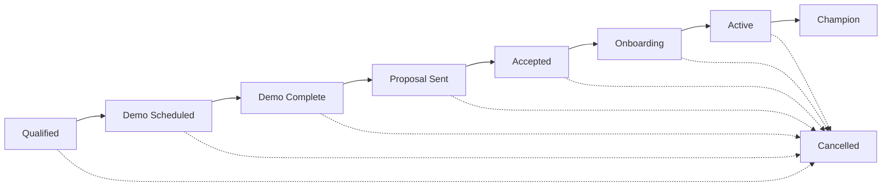
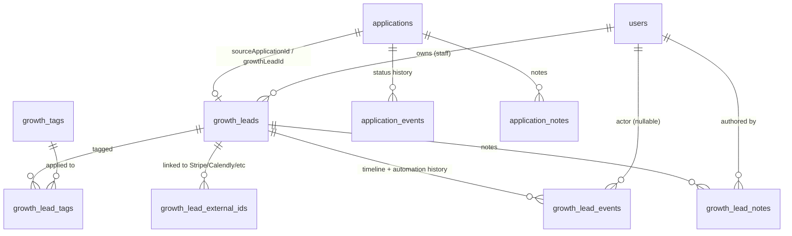

# Kynovant — Growth CRM

Design specification for the internal coach-acquisition pipeline · August 2026

---

## 0. What This Document Is

This is a design specification, not an implementation guide. It contains no code beyond illustrative type sketches. Nothing described here should be built until this document is reviewed and approved — the same process already used for the Programming Intelligence Layer (`docs/catalyst-os-programming-intelligence.md`, `docs/catalyst-os-pil-catalog.md`).

**Scope:** an internal tool for Kynovant's own staff to manage the sales pipeline for coaches who might buy the Kynovant platform, from qualified prospect through active-customer and advocacy status — plus, as of this revision, the design of the intake system that feeds it (§4), since that system does not yet persist any data and must exist before Growth CRM has anything to link to.

**Explicitly not in scope:** anything client-facing, anything coach-facing (a coach using Kynovant to run their own business never sees this tool), and any change to `app/admin/page.tsx`'s existing pipeline (Kynovant's own physique-coaching client pipeline — see §1).

**Revision note (this pass):** the initial version of this document assumed the Founding Coach public intake was still the unwired `mailto:` link on `app/(site)/founding-coach/page.tsx`. That page has since been deleted and replaced, on `main`, with a real `/coach-apply` form and a real `/api/coach-applications` endpoint. This revision reconciles Growth CRM against that actual, verified implementation — not against the fuller "applications table + status enum + HQ queue + notes" system that was described when this revision was requested. That fuller system **does not exist in code on any branch of this repository** (verified by direct file read and by `git log --all` / `git ls-tree` across every branch and worktree). §4 designs it, since Growth CRM's stage model and data model both depend on it existing. See §4.0 for the full verification record.

---

## 1. Naming — locked

Three decisions from this document's first pass are now locked by the founder and are not open for further debate in this revision:

1. **Product name: Growth CRM.** Internal name only, never shown to a coach or client. Chosen specifically to avoid colliding with `app/admin/page.tsx`, which is already internally documented (`docs/catalyst-os-data-foundation.md`) as **"the admin CRM"** — a *different* pipeline (Kynovant's own coaching clients, driven by `lib/workflow.ts`'s `LifecycleStage`).
2. **Namespace:**
   - Routes: `app/hq/growth/`
   - Logic: `lib/growth/`
   - Schema tables/enums: prefixed `growth_` (`growth_leads`, `growth_lead_events`, `growth_lead_stage`, etc.)
3. **Access: admin-only.** A coach using Kynovant to run their own business must never see Kynovant's pipeline for acquiring *other* coaches.

**New naming boundary established this revision:** the application-intake domain (§4) is **not** part of the `growth_` namespace. `applications`, `application_status`, `application_events`, `application_notes` carry no prefix. This is deliberate, not an oversight — see §4.1's "why a separate domain" note. Both domains live under the same `admin`-only access model (§2 is unchanged and applies to both).

---

## 2. Actors & Permissions

Unchanged from the first pass. The role system (`lib/db/schema.ts`) has exactly three roles — `client`, `coach`, `admin` — plus `system` for event attribution. No `founder` or `sales` role exists.

**Both the Applications pipeline and Growth CRM are `admin`-only.** This requires one new guard, additive to `lib/auth/guards.ts`:

```ts
// New — mirrors requireCoachOrAdminPage() exactly, but admin-only.
export async function requireAdminPage(): Promise<AuthedUser> {
  const resolved = await resolveSession();
  if (!resolved.ok) redirect("/login?error=access_denied");
  if (resolved.dbUser.role !== "admin") redirect("/login?error=access_denied");
  return { authUser: resolved.authUser, dbUser: resolved.dbUser };
}
```

`requireAdmin()` (the API-guard variant) already exists and needs no change.

**Explicitly rejected pattern:** `components/AdminGate.tsx`'s hardcoded client-side password is real, adjacent security debt discovered during research — not fixed here, but flagged again because both new domains sit directly beside it in the product. Neither should copy it.

---

## 3. Growth CRM Pipeline / Stage Model — revised

Per locked decisions #9–#10: **Growth CRM owns exactly the post-intake commercial lifecycle. It does not model "Lead" or "Application" as its own stages** — those states now belong entirely to the Applications pipeline (§4). This removes the two stages ("lead," "application") and the "qualification" stage's ambiguous overlap with application review that appeared in the first pass of this document.



A `growth_lead` row **does not exist** until something enters it at `Qualified` — there is no earlier Growth CRM stage to be in. See §4.6 for exactly what creates that row.

```ts
export const growthLeadStageEnum = pgEnum("growth_lead_stage", [
  "qualified",
  "demo_scheduled",
  "demo_complete",
  "proposal_sent",
  "accepted",
  "onboarding",
  "active",
  "champion",
  "cancelled",
]);
```

### Stage semantics (entry/exit criteria)

| Stage | Entered when | Exited when | Owner action expected |
|---|---|---|---|
| **Qualified** | An application is marked `qualified` and handed off (§4.6), or staff manually adds a prospect they've already judged qualified (conference contact, warm referral) | Demo gets booked | Book a demo, or work the prospect toward one |
| **Demo Scheduled** | A demo call is booked (Calendly or manual) | The scheduled time passes | Confirm attendance, prep demo |
| **Demo Complete** | Demo call actually happened | Staff sends a proposal or disqualifies | Log outcome as a note/event |
| **Proposal Sent** | Founding-rate terms sent (verbally or in writing) | Prospect responds | Track response, follow up per next-action |
| **Accepted** | Prospect says yes | Onboarding kicks off | Hand off to onboarding checklist |
| **Onboarding** | Account/workspace being set up | Coach completes setup and is using the platform | Track onboarding checklist completion |
| **Active** | Coach is a paying, live Kynovant customer | Stays here indefinitely, or moves to Champion or Cancelled | Standard account management |
| **Champion** | Staff explicitly promotes an Active account (referral, testimonial, reference-call relationship) — never automatic | Rare — only on cancellation | Reference/referral relationship management |
| **Cancelled** | Subscription ends or lead goes permanently cold | Terminal, except explicit reactivation | Churn reason logged |

`Cancelled` reachable from any stage except `Champion` directly (conceptually de-promotes to `Active` first). Reactivation from `Cancelled` is an explicit staff action that logs a new stage-history entry rather than mutating history — this and the Champion-promotion rule are unchanged from the first pass and remain open for founder confirmation (§12).

---

## 4. Integration With the Founding Coach Application Pipeline

### 4.0 Current, verified state — read this before anything else in this section

Before revising this document, the actual code was checked directly — every branch, every worktree, `git log --all`, `git ls-tree` — not assumed from the request that prompted this revision. Here is exactly what exists today, on `main` (commit `115af79`, `feat: add Founding Coach pricing page and application funnel`):

| Claimed to exist | Actually exists? | Detail |
|---|---|---|
| `applications` table | **No.** | Zero `pgTable("applications"...)` anywhere in the repo, any branch. |
| `application_status` enum | **No.** | Zero matches for `application_status` / `applicationStatus` anywhere. |
| Public POST endpoint | **Yes.** | `app/api/coach-applications/route.ts`, backing a real form at `app/(site)/coach-apply/page.tsx`. |
| Google Sheets mirror | **Partially — best-effort, not a mirror.** | Forwards to `COACH_APPLICATIONS_GAS_URL` (a Google Apps Script webhook) with a 5s timeout, silently skipped if the env var is unset, failure only logged — never retried, never blocking. |
| Admin email notification | **Yes — best-effort.** | Via `resend`, to `RESEND_ADMIN_EMAIL`, skipped silently if env vars are missing. |
| HQ applications queue/detail pages | **No.** | `app/hq/` has no `applications/` directory on any branch. |
| Coach notes and status transitions | **No.** | No notes table, no status field, no transition logic anywhere. |

**The load-bearing finding:** the current `POST` handler does **not write to a database at all**. Its own header comment says an application "is still recorded (server log)" if the Sheets forward is skipped — meaning, today, an application's only possible durable records are an email in an inbox and/or a row in an external Google Sheet, both explicitly best-effort. If `RESEND_API_KEY`/`RESEND_ADMIN_EMAIL` are misconfigured **and** `COACH_APPLICATIONS_GAS_URL` is unset (both are optional, both fail silently), a submitted application produces **zero durable record of any kind** — the applicant sees a success screen, `POST` returns `{ ok: true }` unconditionally, and nothing else happens. This is the concrete, current risk that makes "add real persistence" the load-bearing first step of everything below — not a nice-to-have alongside Growth CRM, but a prerequisite gap in already-shipped code.

The real, current form (`app/(site)/coach-apply/page.tsx`) submits these fields via `FormData`, exactly:

```
name, email, phone, business_stage, client_count, context, referral_source
```

`business_stage` is one of five fixed options ("Just getting started" … "Other"); `client_count` is one of four fixed bands ("0–5" … "30+"); `context` is a freeform textarea ("What's held you back from a system like this?"); `referral_source` is a fixed-option dropdown. Only `name` and `email` are required server-side.

### 4.1 Two domains, deliberately not one

**Applications** is the system of record for what a person actually submitted. **Growth CRM** is the system of record for what Kynovant's sales staff is doing about it. Locked decision #4 makes this explicit: *"Public applications remain immutable source records for what applicants originally submitted."* Merging the two into one table (one mutable row that's both "what they said" and "where the deal is") would make immutability structurally impossible — the moment sales edits a phone number or a business name, the original submission is gone. Two tables, one directional link, is the only shape that satisfies decision #4 and decision #8 (*"Preserve the original application answers even if the sales team later edits the lead profile"*) simultaneously.

This is why `applications` carries no `growth_` prefix: it is not a Growth CRM concept. It predates Growth CRM's involvement, and it will keep existing exactly as-is even for the applications that are disqualified and never become a lead at all.

### 4.2 Schema — `applications`

```ts
export const applicationStatusEnum = pgEnum("application_status", [
  "new",           // just submitted, unreviewed
  "reviewing",     // a staff member has started reviewing
  "qualified",     // fit confirmed — handed off to Growth CRM (terminal for this table)
  "disqualified",  // not a fit (terminal)
  "duplicate",     // resolved as a duplicate of another application (terminal, non-error)
]);

export const applications = pgTable(
  "applications",
  {
    id: uuid("id").primaryKey().defaultRandom(),

    // ── Immutable — set once at INSERT, never updated by anyone, ever.
    // This is the enforcement mechanism for decision #4/#8: there is no
    // UPDATE statement anywhere in the codebase permitted to touch these
    // columns. Enforce this at the service-layer function signature level
    // (no updateApplicationContent() function should ever exist) rather
    // than relying on a DB trigger — matches this codebase's existing
    // convention of enforcing invariants in the service layer, not SQL.
    name: text("name").notNull(),
    email: text("email").notNull(),
    phone: text("phone"),
    businessStage: text("business_stage"),
    clientCount: text("client_count"),
    context: text("context"),
    referralSource: text("referral_source"),
    // Full original payload as submitted, including any fields the form
    // adds later that don't yet have a dedicated column — forward-
    // compatible with form changes without a migration.
    rawFormData: jsonb("raw_form_data").notNull(),
    submittedAt: timestamp("submitted_at", { withTimezone: true }).notNull().defaultNow(),
    sourceIp: text("source_ip"),   // abuse/rate-limit forensics only — never shown to staff as a "field"
    userAgent: text("user_agent"),

    // ── Mutable — staff-owned triage state. Everything below this line can change.
    status: applicationStatusEnum("status").notNull().default("new"),
    statusUpdatedAt: timestamp("status_updated_at", { withTimezone: true }).notNull().defaultNow(),
    reviewerId: uuid("reviewer_id").references(() => users.id, { onDelete: "set null" }),

    // Set exactly once, at the moment of handoff (§4.6). Null until then.
    growthLeadId: uuid("growth_lead_id").references(() => growthLeads.id, {
      onDelete: "set null",
    }),

    // Dedup — see §4.4. Self-referential FK, null unless flagged.
    duplicateOfApplicationId: uuid("duplicate_of_application_id"),

    createdAt: timestamp("created_at", { withTimezone: true }).notNull().defaultNow(),
    updatedAt: timestamp("updated_at", { withTimezone: true }).notNull().defaultNow(),
  },
  (table) => [
    index("idx_applications_status").on(table.status),
    index("idx_applications_email").on(sql`lower(${table.email})`),
    index("idx_applications_growth_lead_id").on(table.growthLeadId),
  ],
);
```

`application_events` and `application_notes` follow the exact shape of `growth_lead_events`/`growth_lead_notes` (§ below) — append-only event log, editable notes thread — for the same reasons given there. Not re-derived here to avoid duplication; see §4.8 for the specific event types this table's lifecycle produces.

### 4.3 Record-Linking Strategy

Two FKs, one on each side, per locked decision #7:

- `applications.growthLeadId` → `growth_leads.id` (nullable — most applications never convert)
- `growth_leads.sourceApplicationId` → `applications.id` (nullable — a lead can also be created without an application, e.g. a manually-added referral)

Both are set together, in the same transaction, only at handoff (§4.6). Neither is ever set independently — a `growth_lead` with a non-null `sourceApplicationId` and an `application` whose `growthLeadId` points somewhere else is an invariant violation that should never be reachable through the service layer.

**Why not a single shared primary key or a view instead of two tables?** Because a lead can, over its lifetime, end up associated with more than one application (a coach applies, goes quiet, reapplies eight months later under the same identity) — §4.4 handles that as a *linking* decision, not a *merging* one. Keeping both tables independently addressable, joined by explicit FKs, is what makes that possible without ever needing to synthesize a fake composite identity.

### 4.4 Deduplication Rules

Two separate dedup problems, handled differently, because they have different failure costs:

**A. Duplicate applications** (same person submits the form twice — double-click, or a genuine re-application). Matched on normalized (lowercased) email against any **open** application (`status` in `new`/`reviewing`) — not against `qualified`/`disqualified` ones, since a second submission after a prior application was already resolved is meaningful new information, not noise. On match: the newer row is still inserted (never silently dropped — decision #4's immutability applies to *every* submission, not just the first), tagged `duplicateOfApplicationId → <earlier row>`, `status → duplicate`, and surfaced in the HQ queue folded under the original rather than as a second unreviewed card. Staff can unlink it with an explicit action if the match was wrong (e.g., a different person with a shared email — rare but possible for a shared studio inbox).

**B. Duplicate lead identities** (decision #6 — *"one person/company should not produce disconnected application and lead identities"*). This is checked exactly once, at handoff (§4.6), by normalized email against **all** existing `growth_leads` regardless of stage — including `cancelled`, since a cancelled coach re-applying is a win-back scenario that should link to their prior history, not start fresh. This match is **staff-confirmed, not silent**: the qualify action surfaces "an existing lead matches this email — link to it, or create a new one anyway?" as an explicit choice. Auto-merging identities silently is the one place in this design where getting it wrong is expensive (two sales histories getting tangled together, or a real second business incorrectly merged into someone else's record) — so, consistent with this codebase's existing stance that judgment calls stay with a human (`AI_PRINCIPLES.md` P-1, applied here by analogy though no AI is involved), the system suggests and a person decides.

### 4.5 Status Synchronization Policy — the actual mechanism that satisfies decision #11

Decision #11: *"Application status and sales-pipeline stage must not become two conflicting sources of truth."* The mechanism this document proposes is not bidirectional sync (two mutable fields kept in lockstep forever, which is exactly the pattern that produces drift bugs) — it's **sequential ownership with a single, one-way handoff**:

- `application.status` is the only source of truth for **pre-qualification** state (`new → reviewing → qualified | disqualified | duplicate`).
- The moment `status` reaches `qualified`, it **freezes**. It is never read again by anything that needs "current deal state" — it becomes purely historical, answering only "how did this application get triaged," never "where is this deal now."
- `growth_lead.stage` becomes the *only* source of truth for everything after that instant.

There is exactly one write path that ever sets `application.status = 'qualified'`, and it is the same transaction that creates/links the `growth_lead` — the two facts ("this application is qualified" and "here is the resulting lead") are recorded atomically, once, and never renegotiated. If a mistake is made, the fix is an explicit `Undo Qualification` admin action — not a background reconciliation job — which reverts `status → reviewing`, clears both FK pointers, and logs the reversal as its own event on both tables. This is the whole answer to "conflicting sources of truth": there is only ever one active source of truth at any given moment, because ownership transfers exactly once and does not transfer back except through an explicit, logged, rare correction.

### 4.6 Handoff Event

A single staff-triggered action, `qualifyAndCreateOrLinkLeadAction`, invoked from an application's detail page. Runs inside one `db.transaction()`:

1. Normalize the application's email; look up existing `growth_leads` by normalized email (§4.4B).
2. **If staff confirms a link:** set `applications.growthLeadId` to the existing lead's id. Do **not** overwrite any field on the existing `growth_leads` row from the application — the lead's working profile stays whatever sales has already built; the application is additional history, not a profile refresh. If the linked lead is `cancelled`, this is where staff would separately trigger `Reactivate` (§3) — the link and the reactivation are two distinct, both-logged actions, not one implicit behavior.
3. **If no match, or staff chooses "create new":** insert a `growth_leads` row — `stage: 'qualified'`, `stageEnteredAt: now()`, `source: 'application'`, `sourceApplicationId: application.id`, and `contactName`/`email`/`phone`/`businessName` **copied** from the application's immutable fields at this instant (decision #8 — a copy, not a live reference, so sales editing the lead's phone number later never touches `applications.phone`).
4. Set `applications.status = 'qualified'`, `applications.growthLeadId = <resulting lead id>`.
5. Write one `application_events` row (`eventType: "qualified_to_lead"`, `toValue: <leadId>`) and one `growth_lead_events` row (`eventType: "created_from_application"` or `"linked_from_application"`, `actorType: "staff"`, `metadata: { applicationId }`) — cross-referenced so either timeline shows the connection.
6. `revalidatePath` both the application detail route and the lead detail route.

If any step fails, the whole transaction rolls back — no partial link state is ever visible. The action is safe to retry as-is (re-running step 1's lookup will simply find the lead created in a prior failed attempt, if that write actually committed, or find nothing and proceed cleanly if it didn't).

### 4.7 Migration Path

Ordered, each step independently shippable:

1. Add `applications`, `application_status`, `application_events`, `application_notes` — new `lib/db/schema-applications.ts` + migration. Nothing in the public form or endpoint changes yet.
2. Modify `app/api/coach-applications/route.ts`: insert into `applications` as a new, **mandatory, synchronous** step, placed *before* the existing best-effort `Promise.allSettled([forwardToGas, notifyAdmin])` call. The existing email/Sheets side effects are otherwise untouched — they simply become genuinely "best-effort" (redundant/nice-to-have) instead of being, unbeknownst to the applicant, the *only* record.
3. Build `app/hq/applications/` (queue + detail, read-only against the new table) — this alone delivers a real, durable application inbox and is valuable independent of Growth CRM being built at all.
4. Add `lib/db/schema-growth.ts` (§5–§6 below), including the `sourceApplicationId`/`growthLeadId` link columns from day one — do not ship `growth_leads` without them and retrofit later.
5. Build the qualify/handoff action (§4.6).
6. Build `app/hq/growth/` per the phased plan in §10.
7. **Optional, not required for launch:** a one-time backfill script reading any rows already present in the Google Sheet (if `COACH_APPLICATIONS_GAS_URL` has been configured and receiving submissions) into `applications`, tagged distinctly (e.g. a `rawFormData.importSource: "sheet_backfill"` marker) so pre-migration applications aren't permanently invisible to the new queue. This is explicitly deferred — most value comes from step 1–3 regardless of whether backfill ever happens.

### 4.8 Failure / Retry Behavior

- **The `applications` INSERT (step 2 above) is the one mandatory operation in the POST handler.** If it fails, the handler returns a `500` and the applicant sees an error and can retry — a real behavior change from today, where `POST` always returns `{ ok: true }` regardless of what happened downstream (see §4.0's load-bearing finding). This is the correct tradeoff: a rare DB error producing a visible retry is far better than a silent, invisible data loss on every request.
- **Email notification and the Sheets forward remain exactly as best-effort/non-blocking as they are today** — `Promise.allSettled`, logged on failure, never surfaced to the applicant, never retried automatically. They're allowed to stay this loose specifically *because* the DB insert is no longer relying on them for durability.
- **No client-supplied idempotency key in v1.** Keeping the form simple; accidental double-submits are caught after the fact by the dedup rule in §4.4A rather than prevented at write time. A hard uniqueness constraint on email is deliberately **not** placed on `applications` — a person legitimately re-applying months later must not be rejected at the database level.
- **Handoff transaction failure** (§4.6): full rollback via `db.transaction()`, no partial state, safe to retry.

### 4.9 Audit History

Two parallel append-only event logs — `application_events` and `growth_lead_events` — each scoped to its own entity's FK, following the exact precedent already established in this codebase by `enrollmentEvents`/`timelineEvents` (`lib/db/schema.ts`): insert-only, `eventType` as open text rather than a closed enum (new event types shouldn't require a migration), `actorId` nullable with `SET NULL` so history survives staff-account changes, `metadata` jsonb for event-specific detail.

Representative `application_events` types this lifecycle produces: `submitted`, `status_changed` (`fromValue`/`toValue` = status strings), `note_added`, `duplicate_detected`, `duplicate_unlinked`, `qualified_to_lead`, `handoff_undone`. The one moment that writes to *both* logs is the handoff itself (§4.6, step 5) — every other event is local to its own table. Nothing in either log is ever updated or deleted.

---

## 5. Growth CRM Data Model



### 5.1 `growth_leads` — the core entity (revised)

```ts
export const growthLeads = pgTable(
  "growth_leads",
  {
    id: uuid("id").primaryKey().defaultRandom(),

    // Copied from the source application at handoff time (§4.6), or
    // entered directly by staff for a manually-added lead. Editable going
    // forward — this is explicitly the "working" record, distinct from
    // applications' frozen original (decision #8).
    contactName: text("contact_name").notNull(),
    email: text("email").notNull(),
    phone: text("phone"),
    businessName: text("business_name"),

    // Optional link once the coach actually gets a Kynovant account —
    // set at or after "Onboarding". Nullable: most of the pipeline has
    // no linked user yet.
    convertedUserId: uuid("converted_user_id").references(() => users.id, {
      onDelete: "set null",
    }),

    source: growthLeadSourceEnum("source").notNull(),
    // Set once, at creation, by the handoff action (§4.6). Null for a
    // lead that was never associated with an application at all.
    sourceApplicationId: uuid("source_application_id").references(
      () => applications.id,
      { onDelete: "set null" },
    ),

    stage: growthLeadStageEnum("stage").notNull().default("qualified"),
    stageEnteredAt: timestamp("stage_entered_at", { withTimezone: true })
      .notNull()
      .defaultNow(),

    ownerId: uuid("owner_id").references(() => users.id, { onDelete: "set null" }),

    // Lead score — see §7. Denormalized for fast list-view sorting;
    // recomputed by computeLeadScore(), never hand-edited.
    leadScore: integer("lead_score").notNull().default(0),
    leadScoreBand: leadScoreBandEnum("lead_score_band").notNull().default("cold"),
    leadScoreUpdatedAt: timestamp("lead_score_updated_at", { withTimezone: true }),

    // Revenue value — see §8. A staff-entered/adjusted estimate until a
    // real Stripe subscription exists, then reconciled from it.
    revenueValueCents: integer("revenue_value_cents"),
    revenueValueSource: revenueValueSourceEnum("revenue_value_source")
      .notNull()
      .default("estimated"),

    lastContactedAt: timestamp("last_contacted_at", { withTimezone: true }),
    nextActionAt: timestamp("next_action_at", { withTimezone: true }),
    nextActionNote: text("next_action_note"),

    // AI summary — audit fields modeled directly on AI_PRINCIPLES.md §9's
    // minimum fields for any AI-generated content record.
    aiSummary: text("ai_summary"),
    aiSummaryGeneratedAt: timestamp("ai_summary_generated_at", { withTimezone: true }),
    aiSummaryModelId: text("ai_summary_model_id"),
    aiSummaryInputHash: text("ai_summary_input_hash"), // staleness check, see §9.5

    cancelledAt: timestamp("cancelled_at", { withTimezone: true }),
    cancelledReason: text("cancelled_reason"),

    createdAt: timestamp("created_at", { withTimezone: true }).notNull().defaultNow(),
    updatedAt: timestamp("updated_at", { withTimezone: true }).notNull().defaultNow(),
    archivedAt: timestamp("archived_at", { withTimezone: true }),
  },
  (table) => [
    index("idx_growth_leads_stage").on(table.stage),
    index("idx_growth_leads_owner_id").on(table.ownerId),
    index("idx_growth_leads_next_action_at").on(table.nextActionAt),
    index("idx_growth_leads_lead_score").on(table.leadScore),
    index("idx_growth_leads_source_application_id").on(table.sourceApplicationId),
    uniqueIndex("uq_growth_leads_normalized_email").on(sql`lower(${table.email})`),
  ],
);

export const growthLeadSourceEnum = pgEnum("growth_lead_source", [
  "application",  // created via the handoff in §4.6 — the common path
  "referral",
  "outbound",
  "manual",       // staff added directly, no application involved
]);

export const leadScoreBandEnum = pgEnum("lead_score_band", ["cold", "warm", "hot"]);

export const revenueValueSourceEnum = pgEnum("revenue_value_source", [
  "estimated",   // staff-entered guess
  "proposal",    // derived from the specific proposal sent
  "stripe",      // reconciled from an actual subscription
]);
```

`uq_growth_leads_normalized_email` is what makes §4.4B's dedup lookup exact and fast — one indexed check, not a fuzzy scan.

### 5.2 `growth_lead_events` — timeline *and* automation history, unified

Unchanged from the first pass: "timeline" and "automation history" are the same table, filtered two ways, not two parallel logs — see §4.9 for why the same pattern now also governs `application_events`.

```ts
export const growthLeadActorTypeEnum = pgEnum("growth_lead_actor_type", [
  "staff", "system", "automation",
]);

export const growthLeadEvents = pgTable(
  "growth_lead_events",
  {
    id: uuid("id").primaryKey().defaultRandom(),
    leadId: uuid("lead_id").notNull().references(() => growthLeads.id, { onDelete: "restrict" }),
    eventType: text("event_type").notNull(),
    actorType: growthLeadActorTypeEnum("actor_type").notNull(),
    actorId: uuid("actor_id").references(() => users.id, { onDelete: "set null" }),
    fromValue: text("from_value"),
    toValue: text("to_value"),
    title: text("title").notNull(),
    description: text("description"),
    metadata: jsonb("metadata").notNull().default({}),
    occurredAt: timestamp("occurred_at", { withTimezone: true }).notNull().defaultNow(),
    createdAt: timestamp("created_at", { withTimezone: true }).notNull().defaultNow(),
  },
  (table) => [
    index("idx_growth_events_lead_occurred").on(table.leadId, table.occurredAt),
    index("idx_growth_events_event_type").on(table.eventType),
    index("idx_growth_events_actor_type").on(table.actorType),
  ],
);
```

### 5.3 `growth_lead_notes`, `growth_tags`/`growth_lead_tags`, `growth_lead_external_ids`

Unchanged from the first pass — full definitions there apply as-is:

- **`growth_lead_notes`** — freeform staff commentary, distinct from events (editable/pinnable; events are immutable system facts).
- **`growth_tags` + `growth_lead_tags`** — proper many-to-many join table, not JSONB, for the same reason `external_identities` is relational rather than blob-stored: tags need central rename/color/archive management.
- **`growth_lead_external_ids`** — reuses the existing `external_identities` shape exactly, scoped to Growth leads, for linking to Stripe/Calendly/DocuSign once a lead converts.

---

## 6. Lead Score

Unchanged in approach from the first pass — deterministic and explainable, reusing PIL's finding/evidence shape (`AI_PRINCIPLES.md` P-2/P-5) rather than an opaque AI score:

```ts
export interface LeadScoreFactor {
  label: string;
  points: number;
  weight: "high" | "medium" | "low";
}

export interface LeadScoreResult {
  score: number;
  band: "cold" | "warm" | "hot";
  factors: LeadScoreFactor[];
}

export function computeLeadScore(
  lead: GrowthLead,
  events: GrowthLeadEvent[],
): LeadScoreResult { /* pure function */ }
```

**Illustrative factors, now using the real, verified application fields** (final weights are a product decision — flag for founder review, §12):

| Factor | Signal | Direction |
|---|---|---|
| Stage progression | Current `growth_lead_stage` rank | Later stage = higher score |
| Recency of contact | Days since `lastContactedAt` | Longer gap = lower score |
| Roster size at application | `applications.clientCount` band (0–5 / 6–15 / 16–30 / 30+) | Larger roster = higher (illustrative — a real business decision) |
| Business maturity | `applications.businessStage` ("just getting started" vs. "running an active coaching business") | More established = higher |
| Source quality | `applications.referralSource` (referral typically outperforms cold social) | Referral/colleague = higher |
| Demo attendance | `demo_complete` event exists vs. no-show | Attended = higher |
| Stalling | No stage change in N days | Longer stall = lower |

Recalculated on any event write that touches a scored factor, in the same transaction — never a background job guessing at staleness.

---

## 7. Revenue Value

Unchanged from the first pass: `revenueValueCents` starts `estimated` (e.g., $99/mo founding rate × 12 months ≈ $1,188 first-year value), reconciles to `stripe` once a real subscription is linked via `growth_lead_external_ids`. Pipeline value (raw and, once enough stage-transition history exists, weighted-by-conversion-rate) is computed on read, never stored — and a weighted figure is deliberately withheld until real conversion-rate history exists, for the same reason PIL refuses a fabricated composite score (`docs/catalyst-os-programming-intelligence.md` §E).

---

## 8. UI / How This Integrates Into HQ

### 8.1 Navigation

`HQSidebar.tsx` needs a `role` prop it doesn't currently receive. A new nav section renders only when `role === "admin"`:

```
Coaching                     ← existing, unchanged
  Mission Control / Clients / Programs / Blueprints / Exercise Library / Check-Ins

Applications (admin only)    ← new — the intake queue, §4
  Queue

Growth (admin only)          ← new — the commercial pipeline, §3/§5
  Pipeline
  Leads
```

Applications and Growth are listed as **separate nav sections**, not nested, because they're separate domains with separate lifecycles (§4.1) — collapsing them into one menu item would visually imply they're one system after this document just spent §4 establishing why they aren't.

### 8.2 Route structure

```
app/hq/applications/
  page.tsx                       — Queue: sortable/filterable table, default filtered to status ≠ terminal
  [applicationId]/
    page.tsx                     — Detail: immutable submission + status/notes/events + "Qualify" action
    actions.ts                   — statusChangeAction, addNoteAction, qualifyAndCreateOrLinkLeadAction, flagDuplicateAction

app/hq/growth/
  page.tsx                       — Pipeline board (Kanban-style, one column per stage in §3)
                                    + Growth Overview metrics (funnel counts, pipeline value)
  leads/
    page.tsx                     — Sortable/filterable table view (all leads)
    [leadId]/
      page.tsx                   — Lead detail workspace
      actions.ts                 — changeStageAction, addNoteAction, logContactAction, setNextActionAction,
                                    reassignOwnerAction, addTagAction/removeTagAction, regenerateAiSummaryAction,
                                    promoteToChampionAction, cancelLeadAction, reactivateLeadAction

components/hq/applications/
  ApplicationQueue.tsx
  ApplicationDetailHeader.tsx
  ApplicationNotes.tsx
  QualifyLeadDialog.tsx          — the staff-confirmed link-vs-create choice from §4.4B/§4.6

components/hq/growth/
  PipelineBoard.tsx, LeadCard.tsx, LeadTable.tsx, LeadDetailHeader.tsx,
  LeadTimeline.tsx, LeadNotes.tsx, LeadScoreBadge.tsx, AiSummaryCallout.tsx, StageBadge.tsx, TagPicker.tsx

lib/db/schema-applications.ts     — applications, application_status, application_events, application_notes
lib/db/schema-growth.ts           — growth_leads and everything in §5

lib/applications/
  types.ts, applications-service.ts, events-service.ts

lib/growth/
  types.ts, lead-score.ts, ai-summary.ts, leads-service.ts, events-service.ts
```

Both namespaces follow the same architecture pattern already established throughout HQ (`app/hq/clients/[clientId]` + colocated `actions.ts`): server-component pages call service functions directly — no `app/api/internal/*` round-trip, HQ doesn't use that pattern anywhere — mutations go through Server Actions that independently re-check `requireAdmin()` regardless of the page-level `requireAdminPage()` guard.

### 8.3 Pipeline board

Unchanged from the first pass: no drag-and-drop dependency exists in this repo. **V1** ships without one — stage change via an explicit action/dropdown, built entirely from existing `Card`/`Dropdown`/`Badge` primitives. **V2** adds `@dnd-kit/core` once the flow is validated.

### 8.4 Applications queue and detail

The queue (`app/hq/applications/page.tsx`) is a straightforward `Table` view — status `Badge`, submitted date, name/email/business stage, reviewer, and (once linked) a pointer to the resulting lead. Default filter excludes `disqualified`/`duplicate` unless explicitly shown, so the working queue stays to what needs attention.

The detail page (`app/hq/applications/[applicationId]/page.tsx`) shows the **immutable** submitted fields at the top (visually distinct — read-only styling, no edit affordance anywhere near them, reinforcing decision #4 in the UI itself, not just the schema), then a `Tabs` split: Notes | Timeline (`application_events`). The "Qualify" action opens `QualifyLeadDialog` — the one place §4.4B's link-vs-create choice surfaces to a human.

### 8.5 Lead detail workspace — "Application" tab, revised

The first pass of this document described this tab as "whatever intake fields were captured... depends on how the mailto CTA gets replaced." That dependency is now resolved: this tab renders the **linked `applications` row** (via `sourceApplicationId`), read-only, with a link out to the full Application detail page in the queue above. If `sourceApplicationId` is null (a manually-added lead), the tab doesn't render at all rather than showing an empty state — consistent with this codebase's existing empty-state philosophy (`docs/VOICE_AND_TONE.md`: "explain why the space is empty... without apology" — here, the honest answer is "there's nothing to explain, this lead simply didn't come from an application," so the tab is absent, not apologetic).

### 8.6 AI Summary, Growth Overview, Automation

Unchanged from the first pass (§7.5/§7.6/§8 there) — staff-triggered generation via Vercel AI Gateway with full `AI_PRINCIPLES.md` §9 audit fields; a Growth Overview landing page for funnel/value metrics; V1 automation is system-logged events only, V2 uses Vercel Cron (no new job-queue dependency) for scheduled rules like stale-lead detection.

---

## 9. Build Phases — revised order

The dependency order changed materially this revision: Growth CRM cannot be built before the applications table exists, because `growth_leads.sourceApplicationId` and the handoff action both require it.

| Phase | Deliverable |
|---|---|
| **A — Application persistence** | `lib/db/schema-applications.ts`, migration, wire the mandatory INSERT into `app/api/coach-applications/route.ts` (§4.7 steps 1–2). Ships real durability for a system that currently has none. |
| **B — Applications HQ queue** | `requireAdminPage()`, `app/hq/applications/` queue + detail (read + status + notes, no Growth CRM dependency yet) |
| **C — Growth foundation** | `lib/db/schema-growth.ts` (with link columns from day one), read-only `app/hq/growth/leads` list + detail |
| **D — Handoff** | `qualifyAndCreateOrLinkLeadAction` (§4.6), `QualifyLeadDialog` |
| **E — Core workflow** | Stage change, notes, tags, owner assignment, next action, contact logging — `growth_lead_events` fully wired |
| **F — Intelligence** | `computeLeadScore()`, AI summary generation, revenue value tracking |
| **G — Nav + Overview** | `HQSidebar` role-awareness, both new nav sections, `app/hq/growth/page.tsx` funnel/overview metrics |
| **H — Automation** | Vercel Cron stale-lead/stale-application detection |
| **I — Polish** | `@dnd-kit` Kanban drag-and-drop, weighted pipeline forecasting once transition history exists, optional Sheet backfill (§4.7 step 7) |

---

## 10. Final Recommended Data Relationship

One paragraph, for reference: **`applications` is the immutable system of record for what a prospect submitted; `growth_leads` is the mutable system of record for what Kynovant's sales team is doing about it.** They are linked by a pair of nullable foreign keys set exactly once, together, in one transaction, at the moment an application is qualified (`applications.growth_lead_id` and `growth_leads.source_application_id`). Ownership of "current state" transfers exactly once, in one direction, at that same moment — `application.status` freezes at `qualified`/`disqualified`/`duplicate` and is never consulted again for pipeline state; `growth_lead.stage` becomes the sole source of truth from that point forward. A lead can exist without a source application (manual/referral entry); an application can exist forever without ever becoming a lead (disqualified). Neither table is ever forced into the other's shape.

---

## 11. Decisions Locked This Revision

For traceability against the request that produced this revision:

1. Product name: **Growth CRM** — locked.
2. Namespace: `app/hq/growth/`, `lib/growth/`, `growth_`-prefixed schema — locked. `applications`/`application_*` explicitly **un**-prefixed (§1, §4.1).
3. Access: admin-only for both Applications and Growth CRM — locked.
4. Applications are immutable source records — enforced structurally (§4.2, no update path to the immutable columns) — locked.
5. A qualified application may create *or link to* a `growth_lead` — locked, mechanism in §4.6.
6. No disconnected identities for one person/company — locked, mechanism in §4.4B (staff-confirmed match, not silent auto-merge).
7. Explicit relational link (`sourceApplicationId` / `growthLeadId`), not a generalized polymorphic source-record association — locked, and deliberately the more specific of the two options: a generalized association (e.g. a single `source_type` + `source_id` pair usable for any future intake channel) was considered and rejected for now as speculative — build the specific link that's needed today; generalize only when a second intake channel actually exists.
8. Original application answers preserved even after lead-profile edits — locked, mechanism is copy-at-handoff (§4.6 step 3), not a live reference.
9. Growth CRM owns exactly the 9-stage post-intake lifecycle listed — locked, §3.
10. No duplicate New/Application stages — locked; those states live entirely in `application_status`, Growth CRM's enum starts at `qualified` (§3).
11. No conflicting sources of truth — locked; mechanism is one-way, one-time ownership transfer, not bidirectional sync (§4.5).
12. No code implementation yet — honored; this document remains specification-only.

---

## 12. Decisions Still Requiring Founder Approval

Unresolved after this revision:

1. **Lead score weights** (§6) — the factor list and point values are illustrative; final weighting is a sales/business judgment call.
2. **"Champion" definition** (§3) — proposed as an explicit manual promotion, never automatic. Confirm.
3. **Stage reversibility** (§3) — proposed: stages move backward freely; `Cancelled` requires explicit `Reactivate` rather than silent un-cancelling. Confirm.
4. **AI provider/model** for summary generation (§8.6) — confirm Vercel AI Gateway, and an appropriately low-cost model tier for a staff-only summary.
5. **`app/admin/page.tsx`'s hardcoded password gate** (`components/AdminGate.tsx`) — not in scope here, but real, adjacent security debt surfaced twice now during this research. Worth its own decision on urgency.
6. **Application queue default filter and SLA** — this revision proposes hiding `disqualified`/`duplicate` by default and does not propose a formal response-time SLA (the current `/coach-apply` copy tells applicants "usually within 48 hours" — should the queue surface an overdue indicator against that promise?). Open.
7. **Sheet backfill** (§4.7 step 7) — confirm whether pre-migration applications (if any exist only in the Google Sheet) are worth recovering, or whether Growth CRM launches clean from Phase A forward.

---

## Document History

| Date | Change |
|---|---|
| 2026-08-01 | Initial design specification |
| 2026-08-01 (rev. 2) | Reconciled against the real, verified `/coach-apply` + `/api/coach-applications` implementation. Added §4 "Integration With the Founding Coach Application Pipeline" (new `applications` domain design — this system does not exist in code yet on any branch; see §4.0). Revised stage model (§3) to start at `Qualified`, removed `Lead`/`Application` as Growth CRM stages. Revised `growth_leads` schema with `sourceApplicationId`. Revised build phases (§9) and locked/open decisions (§11–§12) per founder direction. |
